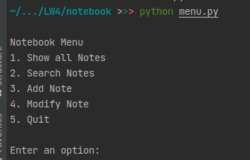
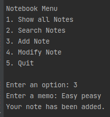
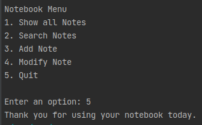

# Notebook

Notebook is Python module to create, hold and modify notes.

## Usage

1. Start the module
2. Choose options to work with notes
3. Quit in the end

```bash
python menu.py
```

<br><br>
<br><br>


## Used sources

- Python 3 Object-oriented Programming Second Edition , Dusty Phillips, 2015